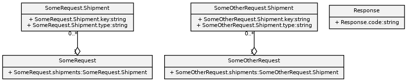
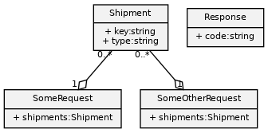

[](https://pypi.org/project/protobuf-uml-diagram/)
[](https://github.com/kinow/protobuf-uml-diagram/blob/master/LICENSE.txt)
[](https://github.com/kinow/protobuf-uml-diagram/actions/workflows/main.yml)
[](https://codecov.io/gh/kinow/protobuf-uml-diagram)

[](https://ko-fi.com/X8X1618T2)

# Protobuf UML diagram

A tool to generate UML diagrams from Protobuf compiled .proto files.

_Usage_:

```bash
$ protobuf-uml-diagram --proto "cylc.flow.ws_messages_pb2" --output /tmp/
```

_Logging output_:

```bash
INFO:__main__:Importing compiled proto cylc.flow.ws_messages_pb2
INFO:__main__:Writing PNG diagram to /tmp/ws_messages_pb2.png
```

_Image output_:


## TL;DR

```bash
$ pip install protobuf-uml-diagram
(…)
$ file issue_10.proto  # See ./test_data/ or use your own .proto file.
issue_10.proto: ASCII text
$ protoc --python_out=./ issue_10.proto
$ # The line below modifies PYTHONPATH, which is not necessary if you have a valid Python module/package.
$ PYTHONPATH=. protobuf-uml-diagram --proto issue_10_pb2 --output /tmp
INFO:protobuf_uml_diagram:Imported: issue_10_pb2
INFO:protobuf_uml_diagram:Writing diagram to /tmp/issue_10_pb2.png
$ eog /tmp/issue_10_pb2.png
```

Running the command above should create a final image with your diagram as seen below.



By default, it uses the full name of the types (e.g. `SomeRequest.shipments`).
If you would like to use simpler names (i.e. `shipments`) you can use the option added
in 0.13 `--full_names=true|false` (it is `true` by default for backward compatibility).

```bash
$ PYTHONPATH=. protobuf-uml-diagram --proto issue_10_pb2 --output /tmp --full_names=false
INFO:protobuf_uml_diagram:Imported: issue_10_pb2
INFO:protobuf_uml_diagram:Writing diagram to /tmp/issue_10_pb2.png
$ eog /tmp/issue_10_pb2.png
```

> Note that doing so, you risk showing fields that are homonyms but that mean different
> things. See the related issues [#10](https://github.com/kinow/protobuf-uml-diagram/issues/10)
> and [#78](https://github.com/kinow/protobuf-uml-diagram/issues/78).



## Installation

```bash
$ pip install protobuf-uml-diagram
$ protobuf-uml-diagram
```

### Development

```bash
$ git clone https://github.com/kinow/protobuf-uml-diagram.git
$ cd protobuf-uml-diagram
$ pip install -e .
$ protobuf-uml-diagram
```

### Docker

Generate UML diagrams from all (not compiled) `.proto` files in a directory:

```
./dockerbuild.sh
./dockerrun.sh <path_containing_proto_files> <output_path>
```

## License

Apache License
