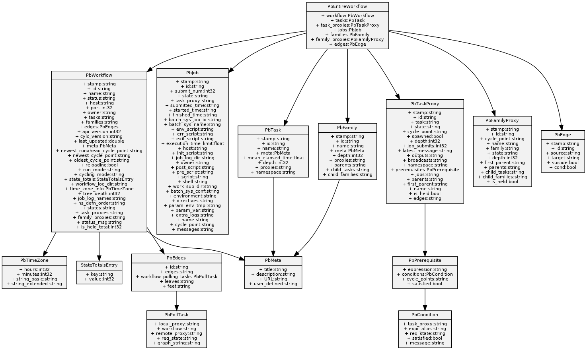

[](https://travis-ci.org/kinow/protobuf-uml-diagram)

# Protobuf UML diagram

A tool to generate UML diagrams from Protobuf compiled .proto files.

_Usage_:

```bash
$ protobuf-uml-diagram --proto "cylc.flow.ws_messages_pb2" --output /tmp/
```

_Logging output_:

```bash
INFO:__main__:Importing compiled proto cylc.flow.ws_messages_pb2
INFO:__main__:Writing PNG diagram to /tmp/ws_messages_pb2.png
```

_Image output_:



## Installation

```bash
$ git clone https://github.com/kinow/protobuf-uml-diagram.git
$ cd protobuf-uml-diagram
$ pip install .
$ protobuf-uml-diagram
```

## License

Apache License
