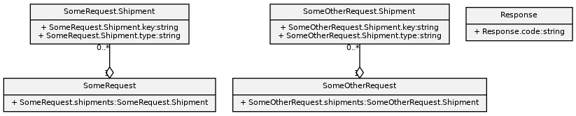
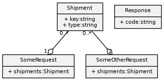

[](https://pypi.org/project/protobuf-uml-diagram/)
[](https://www.python.org/)
[](https://github.com/kinow/protobuf-uml-diagram/blob/master/LICENSE.txt)
[](https://github.com/kinow/protobuf-uml-diagram/actions/workflows/main.yml)
[](https://codecov.io/gh/kinow/protobuf-uml-diagram)

# Protobuf UML diagram

A tool to generate UML diagrams from Protobuf compiled Python modules.

> [!NOTE]
> This tool expects compiled Python protobuf modules (`*_pb2.py`). Install `protoc` separately if you need to compile `.proto` files.

## Example

Generate a UML diagram from a compiled protobuf module:

```bash
protobuf-uml-diagram --proto "cylc.flow.ws_messages_pb2" --output /tmp/
```

Example logging output:

```text
INFO:protobuf_uml_diagram:Imported: cylc.flow.ws_messages_pb2
INFO:protobuf_uml_diagram:Writing diagram to /tmp/ws_messages_pb2.png
```

Example output:


## Installation

```bash
pip install protobuf-uml-diagram
```

### Requirements

- Python >= 3.10
- protobuf >= 7.35.1
- Graphviz installed on the system

## Quick start

Given a protobuf definition:

```bash
file issue_10.proto
issue_10.proto: ASCII text
```

Compile it:

```bash
protoc --python_out=./ issue_10.proto
```

Generate the UML diagram:

```bash
PYTHONPATH=. protobuf-uml-diagram --proto issue_10_pb2 --output /tmp
```

Example output:

```text
INFO:protobuf_uml_diagram:Imported: issue_10_pb2
INFO:protobuf_uml_diagram:Writing diagram to /tmp/issue_10_pb2.png
```

Open the generated image:

```bash
eog /tmp/issue_10_pb2.png
```

The result should look like:



## Names in diagrams

By default, diagrams use the full name of types (for example, `SomeRequest.shipments`).

You can use shorter field names with:

```bash
PYTHONPATH=. protobuf-uml-diagram \
    --proto issue_10_pb2 \
    --output /tmp \
    --full_names=false
```

> [!WARNING]
> Using shorter names can make diagrams ambiguous when different fields have the same name but represent different concepts. See [#10](https://github.com/kinow/protobuf-uml-diagram/issues/10) and [#78](https://github.com/kinow/protobuf-uml-diagram/issues/78).

Example output:



## Docker

The Docker image can generate UML diagrams directly from `.proto` files.

Build the image:

```bash
./dockerbuild.sh
```

Run it:

```bash
./dockerrun.sh <path_containing_proto_files> <output_path>
```

The container:

1. Compiles the `.proto` files using `protoc`
2. Generates Python protobuf modules
3. Produces PNG and SVG UML diagrams

## Development

Clone the repository:

```bash
git clone https://github.com/kinow/protobuf-uml-diagram.git
cd protobuf-uml-diagram
```

Install development dependencies:

```bash
pip install -e ".[all]"
```

Run tests:

```bash
pytest
```

Run type checks:

```bash
mypy .[protobuf_uml_diagram.py](protobuf_uml_diagram.py)
```

## Support

If this project is useful to you, you can support it:

[](https://ko-fi.com/X8X1618T2)

## License

Apache Licence 2.0
